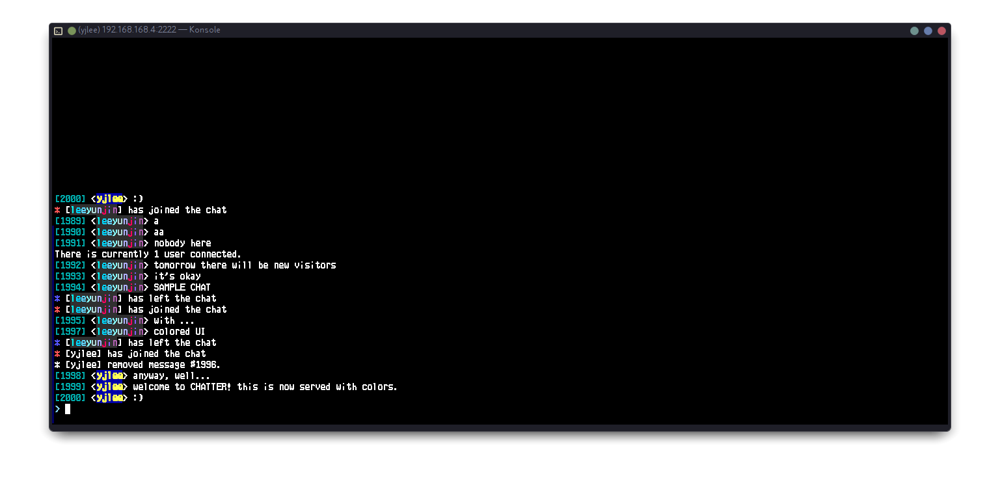

# SSH-Chatter: TUI Bulletin Board System in C


> ssh yournickname@chatter.pw

**General BBS Software**

SSH-Chatter has started from a C reimplementation of the Go [`ssh-chat`](https://github.com/gosuda/ssh-chat) server. It mirrors/extends the original behaviour while using modern C patterns and a small, testable core. The server listens for SSH/TELNET connections and places every authenticated user into a shared chat room that exposes the same command surface as the Go reference implementation.

*Do you know why it takes so long to understand C? Because it is an instinct.*

## Recent enhancements

- Terminal-friendly RSS reader accessible with `/rss list`, `/rss read <tag>`, plus `/rss add <url> <tag>` and `/rss del <tag>` (operators only) so the room can browse headlines together.
- Background BBS watchdog thread that uses the Gemini/Ollama moderation backends to remove posts that advertise crimes or harmful material, plus `/delete-msg` for targeted chat history cleanup.
- `/bbs` command unlocking a retro bulletin board system with tags, comments, bumping, and a multi-line composer that ends on a locale-aware terminator (defaulting to `>/__BBS_END>`).
- `/asciiart` live composer with a 640-line limit, a ten-minute per-IP cooldown, multi-line output, and keyboard shortcuts for cancelling with Ctrl+A and submitting with Ctrl+S or the locale-aware `>/__ARTWORK_END>` default.
- `/birthday` to register birthdays, `/grant <ip>` so LAN operators can delegate privileges by address, and `/revoke <ip>` so top LAN admins can reclaim them.
- Chat UI refresh with a clean divider between history and input, instant input clearing after send, and a friendly "Wait for a moment..." banner
- Friendly multilingual captcha featuring easy comparisons and language-based name counts.
- Expanded nickname support for non-Latin characters plus `/ban` upgrades that accept raw IP addresses alongside usernames.
- `/weather <city>` for quick global forecasts.
- Simplified experience with polls, status messages, and the Eliza moderator removed.

# Preview




## Repository layout

The codebase is intentionally compact so new contributors can navigate it quickly:

| Path | Description |
|------|-------------|
| `src/main.c` | Command-line parsing and process bootstrap (bind address, port, MOTD, host key directory). |
| `src/host_aggregate.c`, `include/ssh_chatter/host.h` | Chat host implementation – session lifecycle, MOTD handling, and hooks for future message broadcast logic. |
| `src/host` | Modular host subsystems that compile into a single translation unit through `src/host_aggregate.c`. |
| `include/ssh_chatter` | Shared headers for the daemon, stress tools, and the translation backend. |
| `include/ssh_chatter/contexts` | Definitions for `session_ctx_t` and related structures that encapsulate per-connection state. |
| `data/banner/banner` | Sample welcome banner that can be pointed to with `CHATTER_WELCOME_BANNER`. |
| `scripts/install_chatter_service.sh` | Convenience installer that builds the binary, installs it under `/usr/local/bin`, and wires up a `systemd` unit (`chatter.service`). |
| `scripts/install_dependencies.sh` | Minimal package installer for build prerequisites on Debian/Ubuntu systems. |

## Architecture


## Staying current with `main`

The `work` branch regularly diverges from upstream development so larger features can
incubate without interrupting production traffic. When it is time to synchronize with
`main`, pull the latest tree and merge it locally before opening a pull request:

```bash
git fetch origin main
git checkout work
git merge --no-ff origin/main
```

Resolve any conflicts in place (the `src/host_aggregate.c` helper routines already mirror the
layout used on `main`, so merges are typically straightforward) and run `make` to
confirm the build still succeeds before pushing the result.

## Automation hooks

- `host_snapshot_last_captcha` exposes the most recently generated captcha prompt and answer along with a timestamp so external clients can pass challenges on behalf of unattended automation.

## Security hardening

- `scripts/safe_permission.sh` tightens the ownership and mode on runtime data files (BBS state, vote state, cooldown snapshots, and general chatter state). Run it after deployment to confine the data directory to `ssh-chatter` and to ensure each file is set to `0600`. Override the targets by passing explicit paths or by exporting `STATE_ROOT` or the corresponding `CHATTER_*_FILE` environment variables before execution.
- A background BBS watchdog periodically feeds posts and comments through the AI moderation pipeline (Gemini primary with Ollama fallback). Flagged posts are removed automatically and a notice is broadcast to the room.
- Chat messages, ASCII art, and BBS posts/comments flow through an AI moderation pipeline. Enable it with `CHATTER_SECURITY_AI=on` (set `GEMINI_API_KEY` for Gemini; the daemon automatically falls back to the local Ollama endpoint at `http://127.0.0.1:11434`). Disable everything with `CHATTER_SECURITY_FILTER=off`. If every provider fails, the filter automatically disables itself to keep conversations flowing instead of silently dropping content.
- SSH transport is pinned to modern key exchanges, ciphers, and MACs, and every bridge payload is wrapped in a triple AES-256-GCM onion so relays only see ciphertext.
- Suspicious submissions that trip the layered filter are now tracked per-IP; repeated hits trigger an automatic kick and ban when enabled, while the rapid reconnect detector allows longer recovery windows so unstable network sessions can rejoin without being penalized. Automatic ban entries are **off by default**; set `CHATTER_AUTO_BAN=on` (or `true`/`1`) to enable them, or leave the variable unset to keep warnings and throttling without writing automatic ban entries.
- Operators can mark trusted ingress points (VPN exits, reverse proxies, localhost) with `CHATTER_PROTECTED_IPS` (comma-separated, defaults to `127.0.0.1,::1,192.168.0.1`) so emergency bans never lock the daemon out of its own control plane.

## File storage and transfers

- All user-managed files now live under `/etc/ssh-chatter/user-files` (override with `CHATTER_FILESTORE_PATH`, legacy fallback: `CHATTER_FILE_STORAGE_ROOT`). The daemon creates the directory if needed and keeps uploads confined to it.
- SSH clients use standard `scp` without any custom wrapper. Treat `/name.ext` as the root of the storage tree: `scp my.zip user@host:/demos/my.zip` writes to `/etc/ssh-chatter/user-files/demos/my.zip` while `scp user@host:/readme.txt ./` downloads `/etc/ssh-chatter/user-files/readme.txt`.
- TELNET clients use the new `/filestore` commands. `/filestore` lists available files, `/filestore-upload` starts an `rz` session, and `/filestore-download <name>` starts an `sz` session. Install `lrzsz` (or any package that provides `rz`/`sz`) on the server so the ZMODEM backend can spawn those helpers.
- `/filestore-upload` accepts an optional destination (for example `/filestore-upload /kitten/meow.png`). SSH-Chatter creates the `/kitten` directory automatically and places the uploaded file there, mirroring how SCP uses paths like `user@host:/kitten/meow.png`.
- Both transports can mix and match: SSH for unattended scripted transfers, TELNET for nostalgic BBS clients with built-in ZMODEM tooling.

## Morse Relay
SSH-Chatter supports amateur ham radio relay.
This shows global morse signals.
`/morse on` to see, `/morse-reply` to send. 

### Protocol Details

The implementation follows the Binkp protocol specification:
- Standard Binkp frame structure with 2-byte headers
- Session password authentication (CMD\_PWD/CMD\_OK)
- Keepalive mechanism (CMD\_NUL) every 60 seconds
- Custom CHAT command (CMD\_CHAT, extension) for message synchronization

## Prerequisites

Building the project requires a POSIX environment with:

- A C23 compatible compiler (e.g. `gcc` or `clang`)
- `make`
- `libssh` development headers and library (`libssh-dev` on Debian/Ubuntu)
- `libcurl` development headers and library (`libcurl4-openssl-dev` on Debian/Ubuntu)
- POSIX threads (usually supplied by the system `libpthread`)
- `python3-pygments` (provides the `pygmentize` highlighter for the Tetris camouflage screen)

On Debian/Ubuntu the dependencies can be installed with:

```bash
sudo apt-get update
sudo apt-get install build-essential libssh-dev libcurl4-openssl-dev
```

## Building from source

Clone the repository and use the provided `Makefile`:

```bash
make
```

This produces an `ssh-chatter` binary in the repository root and a `libssh_chatter_backend.so` shared object that exposes the
translation helpers for reuse in other applications.  Clean intermediate artifacts with `make clean`.

### Using the shared translation backend

The shared object reuses the server's C translation pipeline (including ANSI placeholder preservation) so other processes can
obtain translations without spawning the full SSH host.  Link against `libssh_chatter_backend.so` and include
`include/ssh_chatter/ssh_chatter_backend.h`:

```c
#include "ssh_chatter/ssh_chatter_backend.h"

int main(void) {
  char translated[4096];
  char detected[64];

  if (ssh_chatter_backend_translate_line("Hello, world!", "ko", translated, sizeof(translated), detected, sizeof(detected))) {
    printf("Detected %s -> %s\n", detected, translated);
  }
}
```

Set `GEMINI_API_KEY` (and optionally `GEMINI_API_BASE` or `GEMINI_MODEL`) in the environment so the helper can reach the Google Generative Language API, mirroring the runtime requirements of the main daemon.  You can run `./scripts/test_gemini_connection.sh` before launching the chat server to verify that the credentials allow outbound calls; the script prints the raw Gemini response so you can see whether the request succeeded.

## Running the server manually

The server defaults to listening on `0.0.0.0:2222`.  You can adjust runtime parameters with the available flags:

```
Usage: ./ssh-chatter [-a address] [-p port] [-m motd_file] [-k host_key_dir] [-T telnet_port|off] [-J json_port|off]
       ./ssh-chatter [-h]
       ./ssh-chatter [-V]
```

When provided, `-m` reads the message of the day from the specified file path.

Common examples:

```bash
# Start the chat server on port 2022, loading host keys from /etc/ssh
./ssh-chatter -p 2022 -k /etc/ssh

# Enable telnet access on 0.0.0.0:4242 alongside SSH
./ssh-chatter -T 0.0.0.0:4242

# Serve a custom MOTD from a file and bind to localhost
./ssh-chatter -a 127.0.0.1 -m /etc/ssh-chatter/motd
```


The host key directory must contain an `ssh_host_rsa_key` file (and optional `.pub`).  Generate one with `ssh-keygen -t rsa -b 4096 -f /path/to/dir/ssh_host_rsa_key` if you do not want to reuse your system SSH host keys.  Additional host keys named `ssh_host_ed25519_key` and `ssh_host_ecdsa_key` are loaded automatically when present so the server can offer modern algorithms during key exchange.

### Connecting as a client

Once running, connect with any SSH client:

```bash
ssh -p 2222 user@server-address
```

The public server is available at `bbs.chatter.pw` on the default SSH port:

```bash
ssh -p 2222 yourname@bbs.chatter.pw
```

Usernames provided at the SSH prompt are used as your chat nickname.

Telnet clients can join with the same feature set. Telnet listening is enabled by default on port `2323` and can be adjusted or disabled with the `-T` flag. Provide `-T address:port` to override the bind address (it inherits the SSH bind when omitted; use an empty host like `-T :4242` to listen on all interfaces). For example, to join over telnet from a retro terminal:

```bash
telnet server-address 2323
```

Pass `-T off` (or `-T disable`) to turn the telnet listener off entirely.

### JSON line API

The server also exposes a JSON line protocol over TCP for automation and external integrations. It listens on port `34567` by default and can be disabled or reconfigured with `-J`:

```bash
# Disable the JSON API
./ssh-chatter -J off

# Bind JSON API on a custom port
./ssh-chatter -J 0.0.0.0:45678
```

Each request is a single JSON object terminated by `\n`. Responses and chat events are JSON objects, also newline delimited. The API supports general chat and the `/poll`, `/vote`, `/image`, `/video`, `/audio`, `/files`, and `/asciiart` flows.

**Event payloads (server → client)**

```json
{"type":"event","event":"message","payload":{"id":123,"username":"alice","message":"hello","created_at":1710000000,"system":false,"preserve_whitespace":false,"attachment":{"type":"none","target":"","caption":""}}}
```

**Request examples (client → server)**

```json
{"type":"chat","id":1,"username":"alice","message":"안녕하세요"}
{"type":"image","id":2,"username":"alice","url":"https://example.com/cat.png","caption":"cat"}
{"type":"asciiart","id":3,"username":"alice","message":" /\\_/\\\\n( o.o )\\\\n > ^ <"}
{"type":"poll","id":4,"username":"op","is_operator":true,"question":"Favorite color?","options":["red","blue","green"]}
{"type":"poll","id":5,"username":"bob","action":"vote","choice":2}
{"type":"vote","id":6,"username":"op","label":"weekend","question":"Plan?","options":["hike","rest"],"allow_multiple":true}
{"type":"vote","id":7,"username":"bob","label":"weekend","action":"vote","choice":1}
```

Responses echo the `id` and include `status`, `message`, and optional `result` objects:

```json
{"type":"response","id":4,"status":"ok","message":"poll started","result":{"poll":{"active":true,"allow_multiple":false,"id":10,"question":"Favorite color?","options":[{"index":1,"text":"red","votes":0},{"index":2,"text":"blue","votes":0}]}}}
```

For a runnable example, see `scripts/json_api_example.py`:

```bash
python3 scripts/json_api_example.py --url tcp://127.0.0.1:34567 --save /tmp/json_api_output.txt
```

## Installing as a systemd service

A helper script is provided to automate installation on systems that use `systemd`:

```bash
sudo ./scripts/install_chatter_service.sh
```

What the script does:

1. Compiles the project (`make`).
2. Installs the resulting binary to `/usr/local/bin/ssh-chatter`.
3. Creates a dedicated `ssh-chatter` system user and group (if they do not already exist).
4. Creates `/var/lib/ssh-chatter` for runtime state (including the SSH host key) and `/etc/ssh-chatter` for configuration files.
5. Generates a default RSA host key under `/var/lib/ssh-chatter/ssh_host_rsa_key` when missing.
6. Creates a default MOTD at `/etc/ssh-chatter/motd` and an override file `/etc/ssh-chatter/chatter.env` for environment-based tuning.
7. Writes `/etc/systemd/system/chatter.service`, reloads `systemd`, enables the service, and starts it immediately.

The resulting `chatter.service` unit starts the server with sensible defaults and grants the `CAP_NET_BIND_SERVICE` capability so the non-root service account can bind to privileged ports if required.

### Customising the service

You can adjust defaults by editing `/etc/ssh-chatter/chatter.env` and restarting the service:

```bash
sudo systemctl edit chatter.service   # or edit the environment file directly
sudo systemctl restart chatter.service
```

Supported environment variables include:

- `CHATTER_BIND_ADDRESS` – IP address to bind (default `0.0.0.0`).
- `CHATTER_PORT` – TCP port exposed to clients (default `2222`).
- `CHATTER_MOTD_FILE` – Path to the message-of-the-day file (default `/etc/ssh-chatter/motd`).
- `CHATTER_HOST_KEY_DIR` – Directory containing `ssh_host_rsa_key` (default `/var/lib/ssh-chatter`).
- `CHATTER_EXTRA_ARGS` – Additional arguments appended to the `ssh-chatter` invocation.
- `CHATTER_VOTE_FILE` – Path to the vote state file (default `vote_state.dat`).
- `CHATTER_GEMINI_COOLDOWN_FILE` – Path to the Gemini cooldown state file (default `gemini_cooldown.dat`).
- `CHATTER_SECURITY_FILTER` – Set to `off`/`false`/`0` to disable the layered security filter (enabled by default).
- `CHATTER_SECURITY_AI` – Set to `on`/`true`/`1` to enable AI moderation (disabled by default).
- `CHATTER_FILESTORE_PATH` – Override the managed file storage path (default `/etc/ssh-chatter/user-files`).
- `CHATTER_FILE_STORAGE_ROOT` – Legacy fallback for the managed file storage path.
- `CHATTER_MAX_ALLOC_BYTES` – Upper bound for a single contiguous allocation attempt in the internal memory manager (default `16777216`, i.e. 16 MiB). Requests above this limit fail with `ENOMEM` instead of risking abrupt process termination under memory pressure.

**Camouflage Code Snippets:**
For the Tetris camouflage feature, the runtime expects code snippet files in `/var/lib/ssh-chatter/`.
This repository now includes ready-to-use examples under `./camouflage/` (`c.txt`, `cpp.txt`, `java.txt`, `go.txt`, `js.txt`, `ts.txt`, `rust.txt`).
Copy them to the runtime directory once during setup:

```bash
sudo install -d /var/lib/ssh-chatter
sudo cp camouflage/*.txt /var/lib/ssh-chatter/
```

You can edit any copied file to customize what appears when the camouflage screen is active.

Translation support now relies on the Google Gemini API.  Set the following in `chatter.env` (or the environment) to enable it:

- `GEMINI_API_KEY` – Secret API key used to authenticate translation requests.
- `GEMINI_API_BASE` – Optional override for the API base URL (defaults to `https://generativelanguage.googleapis.com/v1beta`).
- `GEMINI_MODEL` – Optional override for the Gemini model name (defaults to `gemini-2.5-flash`).

When translation is active the chat delivers each message immediately in its original language and follows up with an indented
caption that contains the translated text once the Gemini response arrives.  Reaction summaries use the same caption styling so
updates appear directly beneath the message they reference.

If the inline caption inserts feel jarring you can reserve a small buffer of blank lines ahead of time with `/chat-spacing <0-5>`.
The setting only affects live chat threads—bulletin board content continues to translate without reservation—so you can tune the
spacing for your own session without impacting long-form posts.

Your translation toggle and language choices are saved in `chatter_state.dat`, so future sessions automatically restore the same
configuration once you reconnect.

If you prefer to install without immediately starting the service, run the script with `SKIP_START=1`.

Service management commands:

```bash
sudo systemctl status chatter.service
sudo systemctl restart chatter.service
sudo systemctl disable --now chatter.service
```

## Feature status

### Implemented

- SSH listener that negotiates connections and spawns a thread per session.
- Login Captcha
- MOTD delivery through the `-m` flag or service-managed configuration file.
- `/help` command for connected clients.
- Server-side logging of joins, parts, and administrative command attempts (`/ban`, `/poke`).
- Broadcasting chat messages to all connected participants.
- Color Palettes
- BBS-style personal message
- Media Tag
- Ban User
- Clock
- Nickname Changer
- Chat Scroll
- Checking user list
- Language Translation
- OpenWeather `/weather`
- Named polls with label-based voting, supporting multiple-choice `/vote` polls and single-choice `/vote-single` alternatives, including `/elect <label> <choice>` as a text-friendly voting shortcut.
- Retro bulletin board system accessible through `/bbs` with tagging, comments, bumping, and an interactive composer that ends with a locale-aware terminator (default `>/__BBS_END>`).
- `/asciiart` editor with 640-line drafts, a ten-minute per-IP posting cooldown, multi-line delivery, and Ctrl+A/Ctrl+S shortcuts.
- `/game` hub featuring built-in `tetris` (transcoded from the original Soviet-era C implementation) and `liargame`, both suspendable via `/suspend!` or Ctrl+Z.

### In progress / planned
- Enforcing moderation commands beyond logging.

## Contributing

Issues and pull requests are welcome.  Please include reproduction steps for bugs and ensure `make` succeeds before submitting changes.
